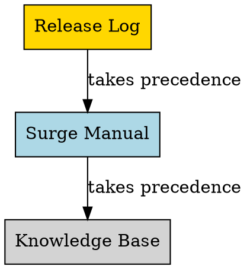

# Surge Documentation Reference

## Overview

Surge has **three authoritative documentation sources** with a clear priority hierarchy. Always consult official sources before inferring behavior.

## Documentation Sources

| Source | URL | Use For |
|--------|-----|---------|
| **1. Surge Manual** | https://manual.nssurge.com/ | Authoritative specifications, configuration reference, exact option definitions |
| **2. Knowledge Base** | https://kb.nssurge.com/ | Practical guides, FAQs, troubleshooting, "how-to" questions |
| **3. Release Log** | appcast-signed-beta.xml | Latest beta updates, recent behavior changes, time-sensitive questions |

## Priority When Sources Conflict



**Rule:** Release Log > Manual > Knowledge Base

## When to Use This Skill

Use this skill when:
- User asks about Surge configuration options
- Need to explain Surge rule syntax or behavior
- Troubleshooting Surge proxy issues
- Questions about DNS, modules, scripts, or policies
- Verifying feature availability or version requirements

**Do NOT use when:**
- Question is about general networking concepts (not Surge-specific)
- User asks about other proxy tools (Clash, V2Ray, etc.)

## Quick Reference Workflow

1. **Check Manual first** - Authoritative specification
2. **Check KB** - Practical guides and examples
3. **Check Release Log** - Recent changes (if relevant)
4. **Answer with citations** - Always include source URLs
5. **If not found** - State "not documented" explicitly

## Key Principles

1. **Do not infer undocumented behavior** - If feature isn't documented, say so
2. **Verify documentation currency** - Check Release Log for recent changes
3. **Cite sources** - Always include Manual/KB URLs in answers
4. **Manual first** - Start with authoritative specification before practical guides

## Red Flags - STOP and Check Official Docs

These thoughts mean you're about to violate the skill:
- "Based on similar features, it probably..."
- "Surge likely works like other proxies..."
- "I remember from a blog post..."
- "Community discussions suggest..."
- "It should work this way..."

**All of these mean: Stop. Check Manual/KB. If not documented, say so.**

## Common Mistakes

| Mistake | Fix |
|---------|-----|
| Mixing blog posts with official docs | Only reference Manual/KB/Release Log |
| Inferring behavior from similar features | State explicitly when behavior is undocumented |
| Using outdated syntax from old tutorials | Verify current syntax in Manual first |
| Assuming features work like other proxy tools | Check Surge-specific documentation |
| Skipping source citation | Always include Manual or KB URLs |

## Documentation Access

**Use WebFetch tool to access:**
- Manual pages: `https://manual.nssurge.com/[section]`
- Knowledge Base: `https://kb.nssurge.com/[article]`
- Navigation guide: `https://nssurge.com/llms.txt`

**Example queries:**
- "Check Surge Manual for DNS over HTTPS configuration"
- "Search Knowledge Base for always-real-ip usage examples"
- "Verify current behavior in Release Log"

## Answer Template

When answering Surge questions:

```markdown
[Clear explanation based on official docs]

**Configuration Example:**
[Code block with actual syntax]

**Official Reference:**
- Manual: [relevant Manual URL]
- KB: [relevant KB URL if applicable]

**Notes:**
- [Version requirements if any]
- [Caveats or limitations from docs]
```

## Real-World Impact

**Without this skill:**
- Agents mix unofficial sources (blogs, forums) with official docs
- Outdated or incorrect configuration examples
- No clear priority when sources conflict

**With this skill:**
- Authoritative answers from official sources only
- Clear precedence hierarchy (Release Log > Manual > KB)
- Proper citation and version awareness
