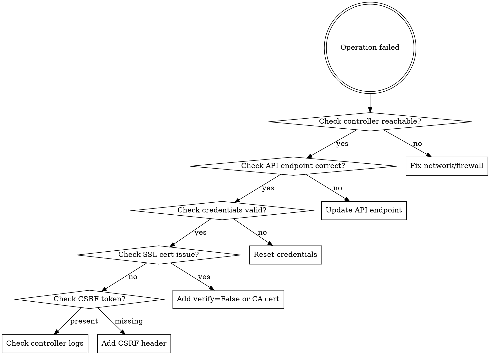

# UniFi Network Management

## Overview

UniFi network management requires proper authentication, version-aware API usage, and security-conscious configuration. **Core principle:** Always verify API endpoints for your controller version, use proper authentication methods, and backup before destructive operations.

## When to Use

Use this skill when:
- Connecting to UniFi Controller API (any version)
- SSH into UniFi devices (AP, switch, gateway, console)
- Automating UniFi network configuration
- Troubleshooting connectivity issues
- Managing UniFi device adoption or provisioning
- **Symptoms:** "UniFi API returns 404", "SSH authentication failed", "device won't adopt", "API endpoint not found", "invalid credentials"

Do NOT use for:
- General networking concepts (not UniFi-specific)
- Third-party controller software (this is for official UniFi Controller/Network Application only)

## Quick Reference

### UniFi Controller API Endpoints

| Task | Endpoint (varies by version) | Method |
|------|------------------------------|--------|
| Login | `/api/auth/login` or `/api/login` | POST |
| List devices | `/api/s/default/stat/device` or `/proxy/network/api/s/default/stat/device` | GET |
| List clients | `/api/s/default/stat/sta` | GET |
| Get site info | `/api/s/default/stat/sysinfo` | GET |
| Logout | `/api/auth/logout` or `/api/logout` | POST |

**CRITICAL:** Endpoint paths vary by controller version. Always check your version's API documentation first.

### SSH Commands Reference

| Task | Command | Notes |
|------|---------|-------|
| Device info | `info` | Shows controller URL, version, model |
| Set controller | `set-inform http://controller:8080/inform` | Adopt device to controller |
| Factory reset | `syswrapper.sh restore-default` | **DESTRUCTIVE** - backup first |
| Reboot | `reboot` | Non-destructive restart |
| View logs | `tail -f /var/log/messages` | Real-time log monitoring |
| Connected clients | `wstalist` | Wireless clients (AP only) |
| Wireless status | `iwconfig` | Check radio status |
| System stats | `mca-cli-op info` | Controller connection status |

### Default Credentials

| Device Type | Username | Password | Notes |
|-------------|----------|----------|-------|
| UniFi Console (UDM, Cloud Key) | `root` | Set during setup | SSH enabled by default |
| UniFi AP/Switch (before adoption) | `ubnt` | `ubnt` | Factory default |
| UniFi AP/Switch (after adoption) | varies | From controller | See Settings > System > Device Authentication |

## Finding Your API Documentation

**Step 1: Check Your Controller Version**

```bash
# Via SSH to controller (UDM/Cloud Key)
ssh root@<controller-ip>
cat /usr/lib/version

# Via API (after login)
curl -k https://<controller-ip>:8443/api/s/default/stat/sysinfo -b cookies.txt
```

**Step 2: Access Version-Specific API Docs**

UniFi Network Application 8.0+ includes built-in API documentation:
1. Navigate to **Settings > Control Plane > Integrations**
2. Click **Localized Network API Documentation**
3. This shows exact endpoints for YOUR version

**Step 3: Community Resources (when official docs unavailable)**

- [Ubiquiti Community Wiki](https://ubntwiki.com/products/software/unifi-controller/api) - Community-maintained API docs
- [Art-of-WiFi GitHub](https://github.com/Art-of-WiFi/UniFi-API-client) - PHP/Python clients with endpoint documentation
- [UniFi Developer Portal](https://developer.ui.com/) - Official developer documentation

## Security Best Practices

### 1. Credentials Management

```python
# ❌ BAD: Hardcoded credentials
username = "admin"
password = "password123"

# ✅ GOOD: Environment variables
import os
username = os.getenv("UNIFI_USER")
password = os.getenv("UNIFI_PASS")

# ✅ BETTER: Credential manager
from keyring import get_password
password = get_password("unifi", username)
```

### 2. SSL Certificate Verification

```python
# ❌ BAD: Disable all SSL verification
requests.get(url, verify=False)

# ✅ GOOD: Verify with custom CA or explicitly acknowledge self-signed
import urllib3
urllib3.disable_warnings(urllib3.exceptions.InsecureRequestWarning)
# AND document why SSL is disabled (self-signed cert)

# ✅ BETTER: Use proper SSL cert
requests.get(url, verify="/path/to/ca-bundle.crt")
```

### 3. SSH Key Authentication

```bash
# Generate SSH key for UniFi management
ssh-keygen -t ed25519 -f ~/.ssh/unifi_key -C "unifi-management"

# Upload to controller (Settings > System > Device Authentication)
# Then SSH without password:
ssh -i ~/.ssh/unifi_key root@<unifi-device>
```

## API Authentication Pattern

### Modern UniFi Network Application (7.0+)

```python
import requests
import urllib3
urllib3.disable_warnings()  # Only for self-signed certs

class UniFiClient:
    def __init__(self, host, username, password, site="default", verify_ssl=False):
        self.base_url = f"https://{host}:8443"
        self.site = site
        self.verify_ssl = verify_ssl
        self.session = requests.Session()
        self.session.verify = verify_ssl
        self.login(username, password)

    def login(self, username, password):
        """Authenticate with UniFi Controller"""
        url = f"{self.base_url}/api/auth/login"
        payload = {"username": username, "password": password}

        response = self.session.post(url, json=payload)
        response.raise_for_status()

        # CSRF token handling (if required by version)
        if "X-CSRF-Token" in response.headers:
            self.session.headers["X-CSRF-Token"] = response.headers["X-CSRF-Token"]

    def get_devices(self):
        """Get all devices"""
        url = f"{self.base_url}/proxy/network/api/s/{self.site}/stat/device"
        response = self.session.get(url)
        response.raise_for_status()
        return response.json()["data"]

    def logout(self):
        """Logout and cleanup session"""
        url = f"{self.base_url}/api/auth/logout"
        self.session.post(url)
        self.session.close()

# Usage
client = UniFiClient("192.168.1.1", "admin", "your-password")
try:
    devices = client.get_devices()
    for device in devices:
        print(f"{device['name']}: {device.get('state', 'unknown')}")
finally:
    client.logout()
```

### Legacy UniFi Controller (5.x-6.x)

```python
# Endpoint differences:
# - Login: /api/login (not /api/auth/login)
# - Device list: /api/s/default/stat/device (not /proxy/network/...)
# - No CSRF token required

def legacy_login(base_url, username, password):
    session = requests.Session()
    url = f"{base_url}/api/login"
    payload = {"username": username, "password": password}

    response = session.post(url, json=payload, verify=False)
    response.raise_for_status()
    return session
```

## SSH Device Management

### Getting Device SSH Credentials

UniFi devices use SSH credentials set in the controller:

1. **Via Web UI:**
   - Settings > System > Advanced > Device Authentication
   - View or set the device SSH username/password

2. **Via API:**
```bash
# After login
curl -k https://controller:8443/api/s/default/get/setting/mgmt \
  -b cookies.txt | jq '.data[0].x_ssh_username, .data[0].x_ssh_password'
```

### SSH Connection Examples

```bash
# UniFi Console (UDM Pro, Cloud Key)
ssh root@192.168.1.1

# UniFi AP/Switch (after adoption)
ssh <device-ssh-user>@192.168.1.50

# With custom SSH key
ssh -i ~/.ssh/unifi_key root@192.168.1.1

# Debugging SSH issues
ssh -v root@192.168.1.1  # Verbose output
```

### Common SSH Tasks

```bash
# 1. Check device info
ssh root@device "info"

# 2. Force device to re-adopt to controller
ssh root@device "set-inform http://192.168.1.1:8080/inform"

# 3. Backup configuration before reset
ssh root@device "cat /tmp/system.cfg" > backup-$(date +%Y%m%d).cfg

# 4. Factory reset (DESTRUCTIVE)
# ⚠️ ALWAYS backup first
ssh root@device "syswrapper.sh restore-default"

# 5. Check controller connectivity
ssh root@device "mca-cli-op info"

# 6. Monitor logs in real-time
ssh root@device "tail -f /var/log/messages"
```

## Common Mistakes

### Mistake 1: Using Wrong API Endpoint Path

**Problem:** API returns 404 or "endpoint not found"

```python
# ❌ BAD: Assuming endpoint path
url = "https://controller:8443/api/s/default/stat/device"
```

**Fix:** Check your controller version first

```python
# ✅ GOOD: Version-aware endpoint selection
def get_device_endpoint(controller_version):
    if controller_version >= 7:
        return "/proxy/network/api/s/default/stat/device"
    else:
        return "/api/s/default/stat/device"
```

### Mistake 2: Not Handling CSRF Tokens

**Problem:** API returns 403 Forbidden on POST requests (UniFi Network 7.2+)

**Fix:** Extract and send CSRF token from login response

```python
# ✅ GOOD: Handle CSRF token
response = session.post(login_url, json=credentials)
if "X-CSRF-Token" in response.headers:
    session.headers["X-CSRF-Token"] = response.headers["X-CSRF-Token"]
```

### Mistake 3: Factory Reset Without Backup

**Problem:** Lost custom configuration after reset

**Fix:** Always backup before destructive operations

```bash
# ✅ GOOD: Backup first
DATE=$(date +%Y%m%d-%H%M%S)
ssh root@device "cat /tmp/system.cfg" > backup-$DATE.cfg
ssh root@device "cat /etc/persistent/cfg/mgmt" > backup-mgmt-$DATE

# Verify backup
ls -lh backup-*

# Then reset
ssh root@device "syswrapper.sh restore-default"
```

### Mistake 4: Using Same Password Everywhere

**Problem:** Compromise of one device affects all devices

**Fix:** Use SSH keys and unique passwords per device class

```bash
# Generate dedicated keys
ssh-keygen -t ed25519 -f ~/.ssh/unifi_console -C "unifi-console"
ssh-keygen -t ed25519 -f ~/.ssh/unifi_devices -C "unifi-devices"

# Upload different keys to different device types
# Configure in UniFi Controller: Settings > System > Device Authentication
```

### Mistake 5: Not Closing API Sessions

**Problem:** Controller hits session limit, denies new logins

**Fix:** Always logout after API operations

```python
# ❌ BAD: No cleanup
client = UniFiClient("controller", "user", "pass")
devices = client.get_devices()

# ✅ GOOD: Proper cleanup
client = UniFiClient("controller", "user", "pass")
try:
    devices = client.get_devices()
finally:
    client.logout()  # Always cleanup

# ✅ BETTER: Context manager
with UniFiClient("controller", "user", "pass") as client:
    devices = client.get_devices()
```

## Troubleshooting Checklist

When UniFi operations fail, check in this order:



### Diagnostic Commands

```bash
# 1. Test controller API reachability
curl -k https://controller:8443/status
# Should return: {"meta":{"rc":"ok"},"data":[]}

# 2. Test SSH connectivity
ssh -v root@device echo "SSH OK"

# 3. Check UniFi service status (on controller)
ssh root@controller "systemctl status unifi"

# 4. View controller logs
ssh root@controller "tail -f /var/log/unifi/server.log"

# 5. Check device adoption state
ssh root@device "info | grep state"
# Should show: Status: Connected (http://controller:8080/inform)
```

## Real-World Impact

**Before using this skill:**
- API scripts break after controller upgrades (wrong endpoints)
- Security issues (hardcoded credentials, disabled SSL)
- Lost configuration after accidental factory resets
- SSH authentication failures (wrong credentials)

**After using this skill:**
- Version-aware API usage (check docs first)
- Secure credential management (environment variables, SSH keys)
- Backup-before-modify workflow (no data loss)
- Proper SSH authentication (controller-managed credentials)

## Additional Resources

- [Official UniFi Help Center](https://help.ui.com/hc/en-us/categories/6583256751383-UniFi)
- [UniFi Controller API - Community Wiki](https://ubntwiki.com/products/software/unifi-controller/api)
- [UniFi SSH Commands Guide](https://lazyadmin.nl/home-network/unifi-ssh-commands/)
- [Getting Started with UniFi API (Official)](https://help.ui.com/hc/en-us/articles/30076656117655-Getting-Started-with-the-Official-UniFi-API)
- [Art-of-WiFi UniFi API Client](https://github.com/Art-of-WiFi/UniFi-API-client)
